<h1 align="center">Non-Linear Curve Fitting for Postsynaptic Current Analysis</h1>

## Table of Contents
- [Initial Set Up](#initial-set-up)
- [Setting up](#setting-up)
- [Quick Start Guide](#quick-start-guide)
- [Step-by-step guide to analyse a dataset](#step-by-step-guide-to-analyse-a-dataset)
  - [Setting the environment](#setting-the-environment)
  - [Simulated example](#simulated-example)
  - [View data](#view-data)
  - [Load data](#load-data)
  - [View imported data](#view-imported-data)
  - [Analyse in RGui using `analyse_PSC`](#analyse-in-rgui-using-analyse_psc)
  - [Fitting data using the UI interface](#fitting-data-using-the-ui-interface)
  - [Analysing an entire data set using the `R` gui](#analysing-an-entire-data-set-using-the-r-gui)
  - [Retrieving analysed data](#retrieving-analysed-data)
  - [Examining analysed data](#examining-analysed-data)
  - [Useful functions](#useful-functions)
  - [Output file structure](#output-file-structure)
- [Known set-up issues](#known-set-up-issues)
- [Curve Fitting Equations](#curve-fitting-equations)

## Initial Set Up

All analysis was performed using the R graphical user interface (GUI) and tested on R version 4.4.1 'Race for Your Life' through to 4.5.1 'Great Square Root'.

- [`R` Statistical Software](https://www.R-project.org/)
- [`XQuartz`](https://www.xquartz.org/) required for graphical output on MacOS
- [`Sublime text`](https://www.sublimetext.com/) or, if you prefer, simply use the default R text editor
- This code uses the package `Rcpp` to compile C++ code.

  On `MacOS`, `R` requires the Xcode Command Line Tools to compile C++ code. To install the tools, open the Terminal and run:
  
  ```bash
  xcode-select --install
  ```

  On a `Windows` PC,  `R` requires `Rtools` instead. The latest version of [`Rtools`](https://cran.r-project.org/bin/windows/Rtools/). After installing Rtools, ensure that the installation path is added to your system's environment variables if `R` does not detect it automatically.

  On Linux (Debian/Ubuntu), R requires development tools to compile packages from source:
  ```bash
  sudo apt-get update
  sudo apt-get install build-essential
  ```

At the least, both `R` and `XQuartz` are essential to install for this code to work.

Always re-install XQuartz when upgrading your macOS to a new major version. 


### Setting up

Only the R console was used for analysis. The examples were written for the R console/R GUI. They should also work in [`RStudio`](https://posit.co/products/open-source/rstudio/), although the interactive plotting behavior may differ. 

Download the code in this directory using the green <span style="background-color:#00FF00; color:white; padding:4px 8px; border-radius:6px; font-family:monospace; display: inline-flex; align-items: center;"> &lt;&gt; Code <span style="margin-left: 4px;">&#9660;</span> </span> dropdown menu followed by `Download Zip`. Unpack and create directory e.g. `/Users/UserName/Documents/Repositories/analysis_Belal2026` replacing `UserName` with your actual `UserName`(!). 

The analysis scripts assume this repository location. and  derives `UserName` from `Sys.getenv('USER')`, so no hidden configuration file is required. In order for the provided R code to work, it is necessary to load various packages within the R environment. Any code preceded by # is `commented out` and is provided in `*.R` files for instructional/informational purposes.

## Quick Start Guide  
 
1. **Open R GUI and source the shared setup file**

 ```R
 # Remove all objects from the environment
 rm(list = ls(all = TRUE))

 UserName <- Sys.getenv('USER')
 root_dir <- file.path('/Users', UserName, 'Documents', 'Repositories', 'analysis_Belal2026')
 source(file.path(root_dir, 'R functions', 'setup.R'))
 ```

 Once this code is run, it should perform all necessary installations, load the required packages, and load the custom-written functions.

2. **Fitting example**

 The following code generates a noisy signal that comprises a single train of responses.

 The inter-event interval (or IEI) is 50 ms and the train comprises 3 responses (N).

 ```R
 dx <- 0.1
 stimulation_time <- 150
 baseline <- 150
 xmax <- 1000
 x <- seq(dx,xmax ,dx)
 N <- 3
 IEI <- 50

 # parameters to generate the fit A1, A2, A3, τ1, τ2 and a delay
 params1 <- c(-150, -250, -300, 1, 30, 4) 
 params1_ <- params1
 params1_[N+3] <- params1_[N+3] + stimulation_time

 std.dev <- 10

 ysignal <- product1N(params=params1_, x=x, N=N, IEI=IEI)
 set.seed(42)
y <- ysignal + rnorm(length(x),sd=std.dev)

 # quick plot if necessary
 # plot(x, y, type='l')

 # to analyse
 analyse_PSC(response=y, dt=0.1, n=30, N=3, IEI=50, stimulation_time=150, 
    baseline=150, func=product1N, return.output=FALSE) 
 ```
 
 When executing the code, graph will appear with dropdown axes to show when the final response has decayed to 10% of its respective peak value. 
 
 A user prompt will appear in `Rgui`:

 'Enter the upper limit for time to use in nFIT (e.g., 400 ms):'

 The entered value represents the cut-off timepoint in the illustrated graph that curve fitting will be performed.

 On entering a suitable variable (for example enter 330 ms), the initial graph will disappear and, after a short period of time, a new graph will appear with the best fit superimposed on the original signal. The output should look something like this:

 ```
 Enter the upper limit for time to use in nFIT (e.g., 400 ms): 
 330
         A1       A2       A3 τrise τdecay tpeak r10_90 d90_10 delay half_width    area1    area2    area3
 1 -148.293 -249.447 -299.051 0.969 30.078  3.44  1.643 66.104 3.978     24.693 5000.808 8411.965 10084.72
 
 Do you want to repeat with "fast constraint" turned on? 
 This constraint ensures the response with the fastest decay also has the fastest rise (y/n): 
 n
 ```
 The output gives: 

 -  $A_1$, $A_2$, $A_3$ the amplitudes of the (N=) 3 responses. 

    The amplitude of subsequent responses in a train are given relative to the previous ones i.e. $A_2$ is the difference between the peak of $A_2$ and decay of $A_1$ etc at the corresponding time point.  

 -  $τ_{rise}$ and $τ_{decay}$ of each underlying response. 

    The code assumed that the kinetics of the response is fixed and not affected by multiple trains of events.

 -  $t_{peak}$ represents the time to peak of the first response relative to the delay period.

 -  delay represents the time from the stimulation to the initial rise of the 1st fitted response.

 -  $r_{10-90}$ and $d_{90-10}$ are the 10-90% rise and 90-10% decays of the underlying response.

 -  $area_1$, $area_2$, $area_3$ represent the areas of the (N=) 3 responses. 

 Clearly, the total area of the fit is given by the sum of the areas i.e. $area_1$ + $area_2$ + $area_3$.

 The final graphical output should be:

 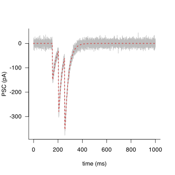

-----------------------------------------------------------------------------------------------
-----------------------------------------------------------------------------------------------

## Step-by-step guide to analyse a dataset

The following code will simulate a set of data that is generated as the sum of underlying responses.

One response is fast with target decay of 30 ms; the other is slower with target decay of 200 ms.  

The simulation with create a dataset of 10 responses with modelled parameters. 

These responses with only differ by added gaussian noise.

 ### Setting the environment

 Run this code to setup the environment correctly:

 ```R
 # Remove all objects from the environment
 rm(list = ls(all = TRUE))

 # Load and install necessary packages
 load_required_packages <- function(packages) {
  new.packages <- packages[!(packages %in% installed.packages()[, 'Package'])]
  if (length(new.packages)) install.packages(new.packages)
  invisible(lapply(packages, library, character.only = TRUE))
 }

 required.packages <- c('robustbase', 'minpack.lm', 'Rcpp', 'signal', 'writexl')
 load_required_packages(required.packages)

 UserName <- Sys.getenv('USER')
 root_dir <- file.path('/Users', UserName, 'Documents', 'Repositories', 'analysis_Belal2026')
 source(file.path(root_dir, 'R functions', 'setup.R'))
 ```
 
 Once this code is run, it should perform all necessary installations and load the necessary packages for the analysis and will load all necessary custom-written functions


 ### Simulated example

 This code creates some example data and saves it in a given folder as an `*.xlsx` excel or `*.csv` spreadsheet.
 
 This step is provided to generate some dummy data for the subsequent analysis and should be skipped if analysing raw data(!). 

 The dummy data **is already provided** so this step can be skipped entirely and user can proceed directly to **Load Data** below.

 ```R
 # parameters for modelled response
 dx <- 0.1
 stim_time <- 150
 baseline <- 150

 xmax <- 1000
 x <- seq(dx,1000 ,dx)

 a1 <- 50; a2 = 100
 tau1.1<- 3; tau1.2 <- 30
 tau2.1 <- 10; tau2.2 <- 200
 d1 <- 2; d2 <- 5; 
 std.dev <- 5
 params = c(a=a1,b=tau1.1,c=tau1.2,d=d1+stim_time,e=a2,f=tau2.1,g=tau2.2,h=d2+stim_time)

 # create data
 set.seed(7)
 data <- sapply(1:10, function(ii){
 ysignal <- product2N(params,x)
 y <- ysignal + rnorm(length(x),sd=std.dev)
 y <- -y
 return(y)
 })

 # save as spreadsheets

 # first create the examples directory in the root directory (root_dir) if it doesn't exist
 dir.create(file.path(root_dir, 'examples'), showWarnings = FALSE)

 # save the data to a CSV file in the examples directory
 csv_file_path <- file.path(root_dir, 'examples', 'data.csv')
 write.csv(data, csv_file_path, row.names = FALSE)

 # save the data to an XLSX file
 xlsx_file_path <- file.path(root_dir, 'examples', 'data.xlsx')
 write_xlsx(as.data.frame(data), xlsx_file_path)
 ```

### View data

 The following code allows the user to view the created simulated data: 
 
 ```R
 # view data
 data[1:10, ]
 ```
 This should return the first 10 rows of each response of a data set (each response is represented by a column of data):

 ```
  [1,] -11.4362358  9.02156400  1.2879531   5.639612  4.6935805  4.9638106 -7.377987679 -5.3563476 -8.33502075 -4.4487588
  [2,]   5.9838584  5.41278827 -1.1184131  -1.700312 -4.3234950 -1.1168718 -4.359361312 -0.7504259 -0.47499372  2.5899406
  [3,]   3.4714626  1.60206229 -5.2290040  -8.368961  1.8007432 -4.4949810 -7.993212019 -1.2612013  1.18757220  0.9400377
  [4,]   2.0614648 -6.14163811 -5.1005224  -2.981428 -5.6017939  0.3309054  8.161036450 -5.6314810  5.84468869  0.1957501
  [5,]   4.8533667  4.36702941  0.5030759 -11.596560 -1.0816668  3.6825770  5.741051105 11.8945648  1.41371073  4.7739120
  [6,]   4.7363997  1.58622938  9.4749848  -2.455668 -4.9955200  1.8744517  0.051002636 -1.2766821  1.40202404 -0.7031591
  [7,]  -3.7406967 -9.07911146 -2.3372169   2.366092  2.4043474  7.0938247  0.002977297  7.6373625 -0.70608889  4.5962251
  [8,]   0.5847761  0.05113925  5.8944714   7.523724 -6.5179967 -3.0086500  2.125299548 -0.0365649 -0.01747515 -1.1345733
  [9,]  -0.7632881  2.82379599 -8.1796819   2.237984  0.9503212  7.2291688  6.313624658  1.7652820  4.99864101  1.2374311
 [10,] -10.9498905 -2.78843376  1.2559864   6.996717  0.9534663 -3.4337208  6.083794268 -3.7968008  4.40553708  6.2209127
 ```

The simulated data is saved in the folder `examples` in the main repository. There are 2 data files (analysis can be performed on both `csv` and `xlsx` files).

 ### Load data

 The following code allows the user to load simulated data using the functions `load_data` or `load_data2`:
 
 If your data is in the form of a `*.csv` or `*.xlsx` you can use the provided functions `load_data` and `load_data2`, respectively to load it into a session of R. 
 
 Examples of simulated data stored as either `*.csv` or `*.xlsx`are already provided in the `examples` folder.

 Again, since this represents the logical startin point for data analysis, run this code to setup the environment correctly:

 ```R
 # Remove all objects from the environment
 rm(list = ls(all = TRUE))

 # Load and install necessary packages
 load_required_packages <- function(packages) {
  new.packages <- packages[!(packages %in% installed.packages()[, 'Package'])]
  if (length(new.packages)) install.packages(new.packages)
  invisible(lapply(packages, library, character.only = TRUE))
 }

 required.packages <- c('robustbase', 'minpack.lm', 'Rcpp', 'signal', 'writexl')
 load_required_packages(required.packages)

 UserName <- Sys.getenv('USER')
 root_dir <- file.path('/Users', UserName, 'Documents', 'Repositories', 'analysis_Belal2026')
 source(file.path(root_dir, 'R functions', 'setup.R'))
 ```


 ```R
 # create path to the working directory
 wd <- file.path(root_dir, 'examples') 

 # to load previously saved CSV file
 data1 <- load_data(wd=wd, name='data')

 # to load previously saved XLSX file:
 data2 <- load_data2(wd=wd, name='data')
 ```

 Note that function load_data2 imports all sheets in the excel file. `data2` is a list of these sheets which are labelled 'Sheet 1', 'Sheet 2' etc.
 
 In this example, the imported data XLSX only contains one sheet. 
 
 This can be accessed as `data2$'Sheet 1` etc.

 ### View imported data

 The following code allows the user to view the imported simulated data: 
 
 ```R
 # view first 10 rows of data imported from CSV file
 data1[1:10, ]

 # view first 10 rows of data imported from XLSX file
 data2$'Sheet1'[1:10,]
 ```
 
 Both return the first 10 rows of each response of a data set (each response is represented by a column of data):
 
 ```
             V1          V2         V3         V4         V5         V6           V7         V8          V9        V10
 1  -11.4362358  9.02156400  1.2879531   5.639612  4.6935805  4.9638106 -7.377987679 -5.3563476 -8.33502075 -4.4487588
 2    5.9838584  5.41278827 -1.1184131  -1.700312 -4.3234950 -1.1168718 -4.359361312 -0.7504259 -0.47499372  2.5899406
 3    3.4714626  1.60206229 -5.2290040  -8.368961  1.8007432 -4.4949810 -7.993212019 -1.2612013  1.18757220  0.9400377
 4    2.0614648 -6.14163811 -5.1005224  -2.981428 -5.6017939  0.3309054  8.161036450 -5.6314810  5.84468869  0.1957501
 5    4.8533667  4.36702941  0.5030759 -11.596560 -1.0816668  3.6825770  5.741051105 11.8945648  1.41371073  4.7739120
 6    4.7363997  1.58622938  9.4749848  -2.455668 -4.9955200  1.8744517  0.051002636 -1.2766821  1.40202404 -0.7031591
 7   -3.7406967 -9.07911146 -2.3372169   2.366092  2.4043474  7.0938247  0.002977297  7.6373625 -0.70608889  4.5962251
 8    0.5847761  0.05113925  5.8944714   7.523724 -6.5179967 -3.0086500  2.125299548 -0.0365649 -0.01747515 -1.1345733
 9   -0.7632881  2.82379599 -8.1796819   2.237984  0.9503212  7.2291688  6.313624658  1.7652820  4.99864101  1.2374311
 10 -10.9498905 -2.78843376  1.2559864   6.996717  0.9534663 -3.4337208  6.083794268 -3.7968008  4.40553708  6.2209127
 ```
 The output is identical to the originally created data (step 3). The only difference is the columns have been named V1, V2...

 ### Analyse in RGui using `analyse_PSC`

 The user can analyse a given column of data using the function `analyse_PSC`. 

 Each column of data represents a single PSC sampled at 10 KHz (sample interval was 0.1 ms).
 
 ```R
 # any response can be accessed data1[,1] or data1[,'V1'] where V1 is the appropriate column name 
 out1 <- analyse_PSC(response=data1[,1], dt=0.1, 
    func=product2N, stimulation_time=150, baseline=50) 
 ```
 Assuming the fit.limits input of analyse_PSC is not specified, a graph of the response will appear with a ablines to indicate the time point where the peak of the response has dropped 10% (default). 

 Use the indicated time as a reference for setting the time point at which fitting of the response will cease. 

 For example, entering '510' returns a graphical output of the fits and a table with values for amplitude, τrise, τdecay, tpeak, $r_{10–90}$, $d_{90–10}$, delay and area for the fast and slow (decay components).

 The user is then asked whether the fit should be repeated with a 'fast constraint' applied. 

 When 'y' is entered, the fit is repeated to ensure that responses with the fastest decay also have the faster rise time. 

 In this (and most cases), it is not necessary to repeat the fit since this requirement is already fulfilled. 

 The option to repeat is included for PSC fitting as most dual component PSCs will often fulfil this criterion and any arising fits that do not can simply be rejected if the user considers this a necessary constraint. 
 
 ```
 Enter the upper limit for time to use in nFIT (e.g., 400 ms): 
 510
           A1  τrise  τdecay  tpeak r10_90  d90_10 delay half_width     area1
 fast -55.305  3.341  26.967  7.964  4.254  60.027 2.064     28.593  2003.821
 slow -98.845 10.550 199.568 32.749 16.397 439.136 5.331    175.964 23244.202
 
 Do you want to repeat with "fast constraint" turned on? 
 This constraint ensures the response with the fastest decay also has the fastest rise (y/n): 
 n
 ```
 The generated output looks like this:

 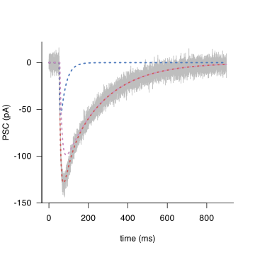


 By setting fit.limits to 510, the output is generated automatically without the need for any user input:

 ```R
 out1 <- analyse_PSC(response=data1[,1], dt=0.1, 
    func=product2N, stimulation_time=150, baseline=50, fit.limits=510) 
 ```
 By specifying a results list, in this case named out1, results can be retrieved from the generated list.

 For example, entering the command

 ```R
 out1$output
 ```

 returns the output table:

 ```
           A1  τrise  τdecay  tpeak r10_90  d90_10 delay     area1
 fast -55.305  3.341  26.967  7.964  4.254  60.027 2.064  2003.821
 slow -98.845 10.550 199.568 32.749 16.397 439.136 5.331 23244.202
 ```

 The fits can be redisplayed using function `fit_plot`:

 ```R
 fit_plot(traces=out1$traces, func=product2N, xlab='time (ms)', ylab='PSC (pA)', 
    lwd=1.2, height=5, width=5, save=FALSE)
 ```

 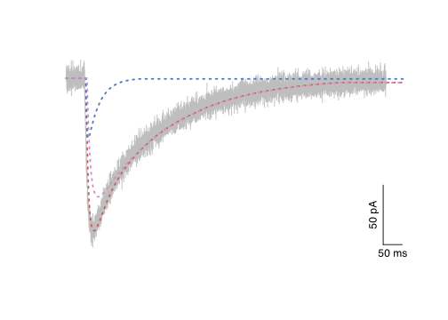


  
 ### Fitting data using the UI interface

 The following instructions are provided for using the Shiny-based UI interface i.e. by running the function `analysePSC()`.
 
 a. **Open `Terminal` and launch `R`**
 
 ```
 R --no-save
 ```

 b. **Clear environment, load packages and set paths**

 Once `R` has lauched then enter the following code into the `Terminal` to load and install necessary packages and then create the path to the repository:
 
 ```
 rm(list = ls(all = TRUE))
 graphics.off()
  
 load_required_packages <- function(packages) {
   new.packages <- packages[!(packages %in% installed.packages()[, 'Package'])]
   if (length(new.packages)) install.packages(new.packages)
   invisible(lapply(packages, library, character.only = TRUE))
 }
  
 required.packages <- c('dbscan', 'minpack.lm', 'Rcpp', 'robustbase',
    'shiny', 'shinybusy', 'signal', 'readxl', 'openxlsx')
 load_required_packages(required.packages)
  
 UserName <- Sys.getenv('USER')
 root_dir <- file.path('/Users', UserName, 'Documents', 'Repositories', 'analysis_Belal2026')
 source(file.path(root_dir, 'R functions', 'setup.R'))

 ```

  c. **Launch the User Interface**  

  ```
  analysePSC()
  ```

  This launches an interactive Shiny interface in your default web browser.

  The `UI` should open:

  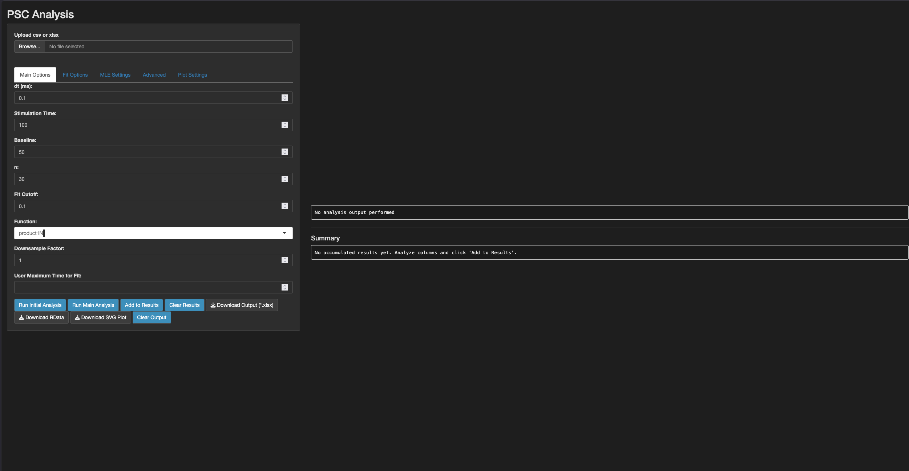 
 
  d. **Upload `csv` or `xlsx`**  

  In the `UI`, click the **`Browse`** button and select your file (e.g. `data.xlsx`).

  e. **Select column**  

  In the `UI`, use the dropdown menu **`Select Column to Analyse`** to select the trace to analyse. The default is to choose the first column (in this example this is V1).

  f. **Set options in `Main Options` dropdown menu** (all selections in the `ui`)
 
  - **`dt`**: the trace in this example was sampled at 0.1 ms (this is the default setting of 10 KHz sampling).
  - **`Stimulation time`**: change stimulation time to 150 ms; the asterix used to denote the stimulu should shift into the correct position.
  - **`Baseline`**: set baseline to some reasonable value (to reproduce this example use 50 ms); the only requirement is that baseline is less than or equal to the stimulation time. 
  - **`n`**: number of fit attempts (30 is default) 
  - **`Fit cutoff`**: default setting 0.1 of the peak response 
  - **`Function`**: default is set to `product1N` to fit one response. For this example choose `product2N`
  - **`Downsample Factor`**: allows the user to downsample the data. This value must be greater than or equal to 1 where 1 indicates no downsampling. Fitting times are directly related to the time window of trace being fitted and the sampling rate, so downsampling can greatly increase fitting speed. However, care should be taken when downsampling a signal, as reducing the sampling rate may compromise the resolution of fast events or distort the shape of rapid transients critical to accurate fitting. It is advisable to verify the integrity of downsampled traces by visual inspection to ensure that key features of the response are preserved.

  g. **Run Initial Analysis**  

  In the `UI`, click the **`Run Initial Analysis`** button.

  A plot will appear with horizontal and vertical lines showing the time at which the response falls to the `Fit cutoff` level (e.g. ~508.4 ms).

  The **`User Maximum Time for Fit`** input box in the `UI` can be altered. In this example, leave the value on the exact cutoff i.e. `508.4` ms. This value defines the end point of the time window over which the fitting will be performed for the displayed trace.

  The `UI` output now looks like this:  
    
  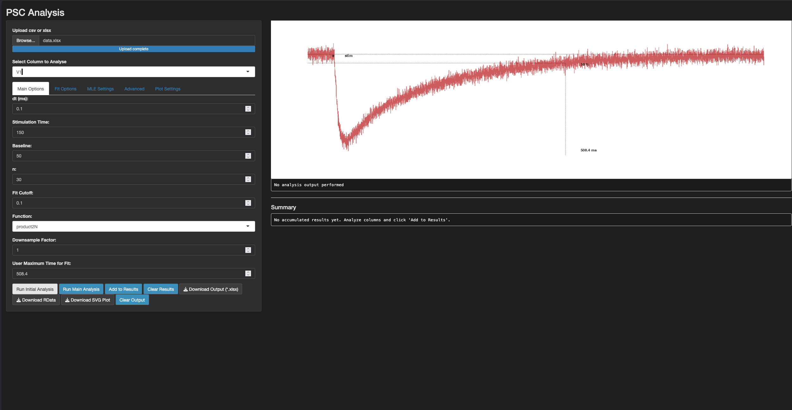

  h. **Run Main Analysis**  

  Click the **`Run Main Analysis`** button to start the fitting procedure.

  After a short delay, the graph will update to show the original response, two fitted responses, and the numerical results in the **`Fit Output`** window.

  The updated output looks like this:
   
  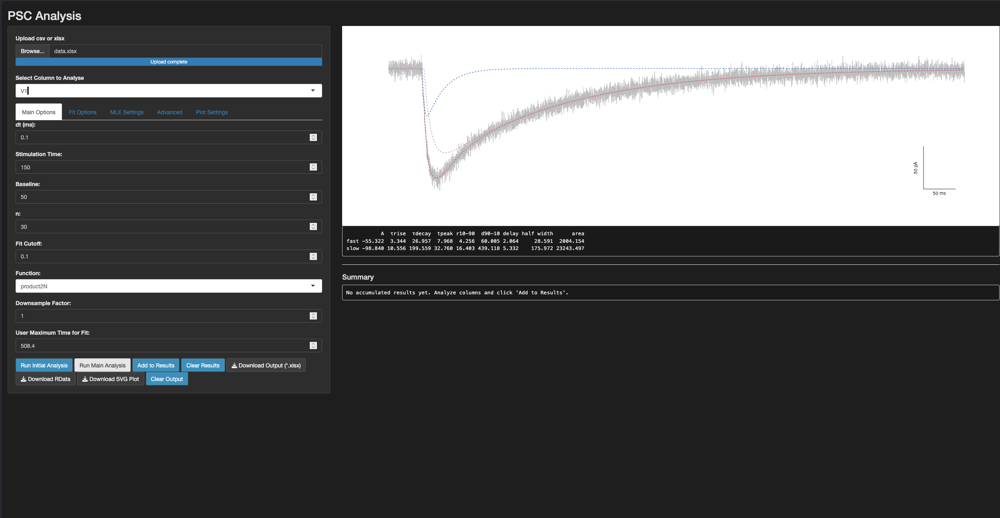

  Having obtained a satisfactory fit, click the **`Add to Results`** button to save the fitted results.

  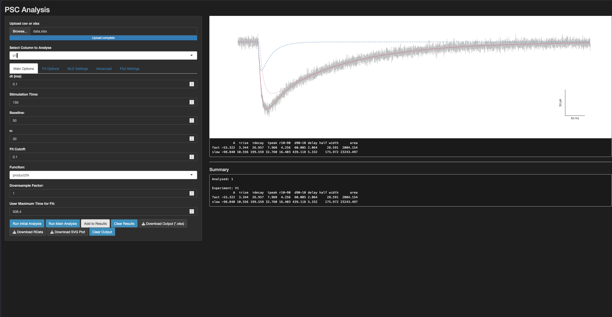

  This procedure is repeated for all columns:
  1. **`Select Column to Analyse`**
  2. **`Run Initial Analysis`**
  3. **`Run Main Analysis`**
  4. **`Add to Results`**

  The procedure is repeated for all columns with the `User Maximum Time for Fit:` generated values:
  
  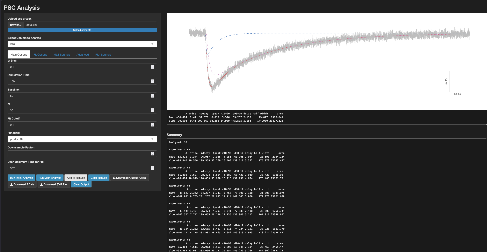
  
  i. **`Download RData`**
  
  Click the **`Download RData`** button to save all fit results in a `.RData` file.

  This allows the user to download the entire results of the fitting process into a format that can be read by R (*.Rdata).

  This includes all the fits (in this case 30 as denoted by n above) and the resultant best fit with the lowest gof  (since all fits are to the same number of points to be fitted (same response) and are fitted with the same equations)

  j. **`Download output (*.xlsx)`**  

  Click the **`Download output (*.xlsx)`** button save the results as a zip file in the `downloads folder`  

   The unzipped folder contains:  
    - summary data in `summary.xlsx`  
    - `xlsx` files for each fit that contains 5 sheets with that fit's main `output` , the raw response and fitted `traces` , associated  `fit criterion` (both AIC and BIC), `model message` and any relevant `metadata`.

  These file should be all that is required to pool across experiments, select a single example and allow the reproduciblity (as all metadata is stored).

  k. **Export Plot to SVG**  

  In the `UI`, click the **`Export Plot to SVG`** button.

  The exported plot is saved in the download folder. 
  
  l. **Clear Output** _(optional)_  

  Click the **`Clear Output`** button to reset the plots and outputs to the `Run Initial Analysis` stage of analysis

  m. **Clear Results** _(optional)_ 

   Click the **`Clear Results`** button to clear all resultsbefore selecting a new dataset to load via the **`Browse`** button.
   
   ### Video walkthrough
   
   A video walkthrough is also available:

   <div align="center">
   <a href="https://github.com/vernonclarke/analysis_Belal2026/raw/refs/heads/main/examples/analysePSC.mov"></a>
   </div>

   The video demonstrates analysis of the first three traces: the first using the default settings, the second using `MLE` with `Random Walk Metropolis` enabled and `n` reduced to 10, and the third using the `robust` fitting method.
   
   
   ### Analysing an entire data set using the `R` gui

   ```R
   # Remove all objects from the environment
   rm(list = ls(all = TRUE))

   # Load and install necessary packages
   load_required_packages <- function(packages) {
    new.packages <- packages[!(packages %in% installed.packages()[, 'Package'])]
    if (length(new.packages)) install.packages(new.packages)
    invisible(lapply(packages, library, character.only = TRUE))
   }

   required.packages <- c('robustbase', 'minpack.lm', 'Rcpp', 'signal', 'writexl')
   load_required_packages(required.packages)

   # enter your UserName here
   UserName <- Sys.getenv('USER')
   root_dir <- file.path('/Users', UserName, 'Documents', 'Repositories', 'analysis_Belal2026')
   source(file.path(root_dir, 'R functions', 'setup.R'))

   # create path to the working directory containing the simulated data from before
   wd <- file.path(root_dir, 'examples') 

   # load example CSV data
   # data <- load_data(wd=wd, name='data')

   # load example XLSX data
   data_list <- load_data2(wd = wd, name = "data")
   data <- data_list[[1]]

   # use analyse_PSC to determine fit.limits for each response in turn with setting return.output=FALSE:
   # analyse_PSC(response=data[,1], dt=0.1, func=product2N, stimulation_time=150, baseline=50, return.output=FALSE) 

   # put obtained upper limits in a vector
   time.limits <- c(508.4, 507.8, 510.5, 508.6, 508.1, 507.7, 502.7, 498.6, 499.7, 507.0)

   # Create an empty list to store results
   out_list <- list()

   # Loop over the columns and store the results in the list
   for (ii in 1:ncol(data)) {
     out_list[[ii]] <- analyse_PSC(response=data[,ii], dt=0.1, func=product2N, 
      stimulation_time=150, baseline=50, fit.limits=time.limits[ii])
   }

   # Change the working directory to 'wd' before saving (this ensures saved environment is withinn the working directory)
   setwd(wd)
   # Save the entire R environment including all objects and variables
   # This will save all objects created during this session and any other data or functions in the environment
   save.image(file = 'example.RData')  
   ```

   ### Retrieving analysed data
   
   Fitting data previously stored in `example.RData`  can be retrieved by the following code:

   ```R
   # Remove all objects from the environment
   rm(list = ls(all = TRUE))

   UserName <- Sys.getenv('USER')
   
   # create path to directory containing example.RData
   root_dir <- file.path('/Users', UserName, 'Documents', 'Repositories', 'analysis_Belal2026')
   wd <- file.path(root_dir, 'examples')
   setwd(wd)

   path <- file.path(wd, 'example.RData')

   load(path)

   # This should load the entire environment which will include the custom functions contained in 'nNLS functions.R'
   # However, any required packages must still be loaded
   # To load and install necessary packages, run the following code as before:
   
   load_required_packages <- function(packages) {
    new.packages <- packages[!(packages %in% installed.packages()[, 'Package'])]
    if (length(new.packages)) install.packages(new.packages)
    invisible(lapply(packages, library, character.only = TRUE))
   }

   required.packages <- c('robustbase', 'minpack.lm', 'Rcpp', 'signal', 'writexl')
   load_required_packages(required.packages)   
   ```

   ### Examining analysed data
   
   Data was stored in a list named  `out_list`. 

   The following code will loop through the saved  data to create a simple matrix-like output of the fitted parameters for each simulation.

   ```R

   # Create a summary table of the results
   # Loop over the list 'out_list', extracting the 'output' element from each result
   # 't()' is used to transpose the extracted results into rows 
   # 'as.vector' flattens the matrix to ensure all values are in a single vector per row
   summary <- t(sapply(1:length(out_list), function(ii){
     X <- out_list[[ii]]$output
     as.vector(t(X))
   }))

   # Create new column names by appending 1 and 2 to the original names
   # The 'rep()' function duplicates each column name from the first output twice
   # This is because the summary now has two rows for each original column
   new_colnames <- rep(colnames(out_list[[1]]$output), 2)

   # Assign the new column names to the summary table
   colnames(summary) <- new_colnames

   # Set row names as the index from 1 to the length of out_list, representing the row numbers (or the index of the analysis results)
   rownames(summary) <- 1:length(out_list)

   # 'summary' now holds the flattened results from all fits contained in 'out_list'
   summary
   ```

   Entering `summary` should output the fit summaries from before in the form of a matrix

   ```
            A1 τrise τdecay  tpeak r10_90 d90_10 delay half_width    area1       A1  τrise  τdecay  tpeak r10_90  d90_10 delay half_width    area1
    1  -55.322 3.344 26.957  7.968  4.256 60.005 2.064     28.591 2004.154  -98.840 10.556 199.559 32.760 16.403 439.118 5.332    175.972 23243.50
    2  -51.892 3.627 28.474  8.564  4.582 63.431 1.900     30.420 1996.080  -98.424 10.979 198.659 33.650 16.913 437.231 4.674    176.486 23161.73
    3  -45.827 2.342 34.207  6.741  3.450 75.396 2.118     31.606 1909.075 -100.051  8.755 201.257 28.695 14.114 442.545 5.000    172.078 23221.64
    4  -43.509 1.434 35.474  4.793  2.341 77.989 2.418     30.008 1766.744 -102.577  7.742 199.655 26.176 12.735 438.906 5.112    167.917 23348.88
    5  -46.324 2.232 33.685  6.487  3.311 74.224 2.121     30.926 1891.779 -100.777  8.715 202.981 28.665 14.082 446.319 4.933    173.214 23558.43
    6  -65.360 4.511 26.013  9.561  5.207 58.645 2.114     30.459 2455.470  -92.864 13.987 202.006 40.127 20.554 445.280 5.268    187.062 22881.25
    7  -65.845 5.728 24.942 10.939  6.039 57.248 1.872     32.120 2546.387  -92.137 15.390 200.473 42.790 22.097 442.347 4.927    189.561 22865.89
    8  -46.532 2.367 29.063  6.463  3.353 64.172 2.155     27.828 1689.127 -102.035  8.866 196.161 28.756 14.195 431.386 5.016    168.688 23175.28
    9  -49.840 3.268 28.896  8.032  4.265 64.170 1.925     29.907 1901.665  -99.503  9.989 198.060 31.423 15.667 435.728 4.977    173.283 23095.93
    10 -50.424 2.470 31.378  6.815  3.526 69.257 2.133     29.827 1966.041  -99.590  9.410 202.569 30.288 14.989 445.515 5.160    174.930 23427.32

   ```

   Note: these example values were generated from `examples/data.xlsx`. The same traces are also provided in `examples/data.csv`; however, CSV and XLSX import can differ at very small floating-point precision levels. Most fits are unaffected, but for traces with two very similar local minima, such as response 3 with `n = 30`, these tiny differences can select a nearby alternative fit. To reproduce the table exactly, use the same file format and import path throughout the console and `analysePSC()` examples.

   ### Useful functions

   Some simple functions for baisc analysis are provided.  

   - **`wilcox.test`**

      Wilcoxon signed-rank test (paired=TRUE argument)
      
      For example, comparing fast and slow amplitudes (i.e. columns 1 and 9 in `summary`):

      ```R
      wilcox.test(summary[,1], summary[,9], paired=TRUE, alternative='two.sided', exact=NULL)
      ```

      This code generates the following output:

      ```
         Wilcoxon signed rank exact test

      data:  summary[, 1] and summary[, 9]
      V = 55, p-value = 0.001953
      alternative hypothesis: true location shift is not equal to 0
      ```

   - **`BoxPlot`**

      Box plot of data sets

      ```R
      # Calculate the number of rows in the 'summary' table (n), then create a new data frame 'A'
      # 's' represents a subjects of 1:n repeated twice (for the two categories in 'x')
      # 'x' represents two groups: the first n rows are labeled 1 for the fast component 
      # amplitude, and the second n rows are labeled 2 for the slow component amplitude
      # 'y' combines the first column of 'summary' and the 9th column (without names) 
      # into a single vector i.e the fast amd slow amplitudes
      n <- dim(summary)[1]
      A <- data.frame(
         's' = rep(1:n,2),
         'x' = c(rep(1,n), rep(2,n)),
         'y' = c(summary[,1], summary[,10])
         )
      
      # show structure of A
      A
      ```
      A data frame (A) is created with three columns (must be named 's', 'x' and 'y'):

      ```
          s x        y
      1   1 1  -55.322
      2   2 1  -51.892
      3   3 1  -45.767
      4   4 1  -43.509
      5   5 1  -46.322
      6   6 1  -65.360
      7   7 1  -65.845
      8   8 1  -46.531
      9   9 1  -49.840
      10 10 1  -50.424
      11  1 2  -98.840
      12  2 2  -98.424
      13  3 2 -100.059
      14  4 2 -102.577
      15  5 2 -100.777
      16  6 2  -92.864
      17  7 2  -92.137
      18  8 2 -102.034
      19  9 2  -99.503
      20 10 2  -99.590
      ```

      This is identical to the 'longitudinal' format for analysing data in statistical tests such as `ANOVA`

      - **s**: subject 

      - **x**: 'level'; 1 for fast and 2 for slow

      - **y**: variable; in this case a column of with fast and slow amplitudes


      The function `BoxPlot` can be used on the data frame A to generate a box plot:

      ```R
      BoxPlot(formula = y ~ x + Error(s), data=A, yrange=c(-120, 0), wid=0.3, cap=0.1, y_tick_interval=20,
        width=3, height=5, tick_length=0.2, lwd=1.25, amount=0.1, p.cex=0.6)
      ```

      The box plot output is illustrated:

      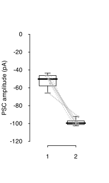

      If data is unpaired, then simply create a data frame omitting the subject column 's' and use `formula = y ~ x` in place of `formula = y ~ x + Error(s)`.


   - **`ScatterPlot`**

      Scatter plot for paired data

      ```R
      ScatterPlot(A, sign=-1, xlim=c(0,120), ylim=c(0,120), x_tick_interval=20, y_tick_interval=20, 
         xlab=expression(A[fast] * ' ' * (pA)), ylab=expression(A[slow] * ' ' * (pA)), 
         lwd=1.25, p.cex=0.6, width=5, height=5)

      ScatterPlot(A, sign=-1, xlim=c(0,120), ylim=c(0,120), x_tick_interval=20, y_tick_interval=20, 
         xlab=expression(A[fast] * ' ' * (pA)), ylab=expression(A[slow] * ' ' * (pA)), 
         lwd=1.25, p.cex=0.6, reg=TRUE, width=5, height=5)

      ScatterPlot(A, sign=-1, xlim=c(40,70), ylim=c(90,110), x_tick_interval=10, y_tick_interval=5, 
         xlab=expression(A[fast] * ' ' * (pA)), ylab=expression(A[slow] * ' ' * (pA)), 
         lwd=1.25, p.cex=0.6, reg=TRUE, plot.CI=TRUE, width=5, height=5)

      ScatterPlot(A, sign=-1, xlim=c(40,70), ylim=c(90,110), x_tick_interval=10, y_tick_interval=5, 
         xlab=expression(A[fast] * ' ' * (pA)), ylab=expression(A[slow] * ' ' * (pA)),
         lwd=1.25, p.cex=0.6, reg=TRUE, plot.CI=TRUE, reg.method='Theil-Sen', width=5, height=5) 

      # plots can be saved to the current working directory by changing default save option to TRUE
      ScatterPlot(A, sign=-1, xlim=c(40,70), ylim=c(90,110), x_tick_interval=10, y_tick_interval=5,  
         xlab=expression(A[fast] * ' ' * (pA)), ylab=expression(A[slow] * ' ' * (pA)),
         lwd=1.25, p.cex=1, reg=TRUE, plot.CI=TRUE, reg.method='Theil-Sen', width=5, height=5, 
         filename = 'scatter.svg', save=TRUE) 
      ```

      The generated output for Theil-Sen regression fit with 95% confidence intervals looks like this:

      


      **Notes on non-parametric fitting procedures:**

      - The Theil-Sen (Kendall) estimator and the Siegel repeated median estimator are robust, non-parametric, distribution-free methods used to estimate the slope and intercept of a linear relationship between two variables. 

      - Unlike traditional least squares methods, these estimators are highly resistant to the effects of noise and outliers in the data, making them particularly useful for datasets that deviate from normality or contain extreme values. 

      - The Theil-Sen estimator calculates the median slope between all pairs of points, while the Siegel estimator computes the median slope for each point relative to all others, further enhancing its robustness. 

      - These methods are reliable alternatives in situations where classical linear regression may fail due to outliers or non-Normal data distributions.


   - **`SingleFitExample`**

      The fitted responses can be plotted from the previously generated `out_list` as the fitted traces are stored within the list structure.

      ```R
      # for the 5th fitted response 
      SingleFitExample(traces=out_list[[5]]$traces, xlim=c(0,800), ylim=c(-140,10), lwd=1.5, 
         height=5, width=5, xbar=100, ybar=25, filename='egs_control_5.svg', save=FALSE)
      
       # equivalent semilog plot 
       SingleFitExample(traces=out_list[[5]]$traces, xlim=c(50,400), ylim=NULL, lwd=1.5, 
         height=5, width=5, xbar=100, filename='semilog_egs_5.svg', log_y=TRUE, save=FALSE)  
      ```

      By making `save=TRUE`, plots are not created but saved to the working directory. 

      In the example above, two `svg` files are created named `egs_control_5.svg` and `semilog_egs_5.svg`, respectively:

      <div style="display: flex; justify-content: space-between;">
          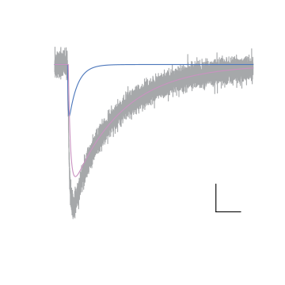
          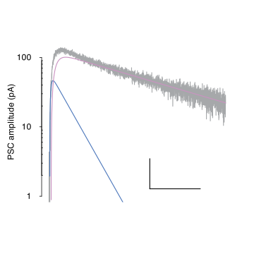
      </div>

      The left plot shows the 2 fits together with the original response. The vertical and horizontal bars represent 25pA and 100ms, respectively.

      The right-hand plot shows the same plot but on as a semilog plot that starts at the stimulation. The vertical and horizontal bars now represent an e-fold change in y and 100ms.


### Output file structure
   
   Here is a brief explanation of the file output structure.  

   out_list is a list that contains relevant output for each of the (n=10) traces analysed in step 7
   each list can be accessed by out_list[[ii]] where ii takes the value from 1 to 10 for each fitted trace
   each fit generates a list of 10 objects; the names of these objects can be displayed using the function `names`
 

   ```R
      # out_list is a list that contains relevant output for each of the (n=10) traces analysed in step 7
      # each list can be accessed by out_list[[ii]] where ii takes the value from 1 to 10 for each fitted trace
      # each fit generates a list of 10 objects; the names of these objects can be displayed using the function `names`
      names(out_list[[1]])
   ```

   The output gives the names of each object in the list:

   ```
   [1] "output"     "fits"     "fits.se"     "gof"     "AIC"     "BIC"     "model.message"     "sign"     "traces"     "fit_results"  
   ```
   To access any object related to the fitting of any response:
   
   ```R
   ii <- 2 # trace 2 
   out_list[[ii]]$output
   out_list[[ii]]$fits
   out_list[[ii]]$fits.se
   out_list[[ii]]$gof
   out_list[[ii]]$AIC
   out_list[[ii]]$BIC
   out_list[[ii]]$model.message
   out_list[[ii]]$sign
   out_list[[ii]]$traces[1:10,]
   # not illustrated
   # out_list[[ii]]$fit_results
 
   ```

   a. **output**

   `out_list[[ii]]$output` gives the obtained best fits for parameters for the iith element of the list `out_list`.

   The illustrated values correspond to the (alternative) form of the product equation:

   $$\boldsymbol{ y = A  (e^{-t/\tau_{decay}} - e^{-t/\tau_{rise}}) }$$

   ```
   out_list[[ii]]$output

             A1  τrise  τdecay  tpeak r10_90  d90_10 delay half_width     area1
   fast -51.892  3.627  28.474  8.564  4.582  63.431 1.900     30.420  1996.093
   slow -98.424 10.979 198.659 33.650 16.913 437.231 4.674    176.486 23161.722
   ```   

   b. **fits**

   `out_list[[ii]]$fits` gives the corresponding parameter fits to (a) above but for the form of the product equation:

   $$\boldsymbol{ y = A (1 - e^{-t/\tau_1}) e^{-t/\tau_2} }$$

   The actual fits are performed using this version of the equation.

   The columns correspond to $[A_1,\ \tau_1,\ \tau_2,\ \mathrm{delay}]$, in this case, repeated twice for the fast and slow component fits

   ```
   out_list[[ii]]$fits
   [1] -51.892398   4.156136  28.474188   1.900023 -98.423523  11.620837 198.659484   4.673744 
   ```   

   c. **fits.se**

   `out_list[[ii]]$fits.se` gives the corresponding standard errors for the parameter fits of (b) above.

   ```
   out_list[[ii]]$fits.se
   [1] 9.6612406 2.0297427 4.4693011 0.1205750 4.0362026 3.1603258 1.5978233 0.2221259
   ```  

   d. **gof**
 
   `out_list[[ii]]$gof` actually gives the standard error or 'RMSE' of the residuals:

   $$\boldsymbol{ gof.se = \sqrt{\frac{\sum (y_i - \hat{y}_i)^2}{n - k}} }$$

   It quantifies the precision of the model’s fit to the data, accounting for the degrees of freedom  df = n - k , where  n is the number of data points and k is the number of estimated parameters in the model.

   ```
   out_list[[ii]]$gof
   [1] 5.08363
   ```

   e. **AIC**
 
   `out_list[[ii]]$AIC` gives the Akaike Information Criterion (AIC) of the fit.

   ```
   out_list[[ii]]$AIC
        AIC 
   27899.86
   ```      
      
   f. **BIC**
 
   `out_list[[ii]]$BIC` gives the Bayesian Information Criterion (BIC) of the fit.

   ```
   out_list[[ii]]$BIC
       BIC 
   27951.3 
   ```
   
   - **Penalization of Model Complexity:**
     - **BIC and AIC:** Both criteria penalize model complexity. They help in avoiding overfitting by penalizing models with more parameters.
     - **Sum of Squares or RMSE:** Neither will penalize for model complexity. A model with more parameters might fit the data better by capturing the noise as a pattern, leading to overfitting.

   - **Model Comparison:**
     - **BIC and AIC:** They allow for the comparison of non-nested models, providing a means to select the best model among a set of candidates.
     - **Sum of Squares or RMSE:** Primarily a goodness-of-fit measure that does not facilitate model comparison directly.

   - **Information Loss:**
     - **BIC and AIC:** They estimate the loss of information when a particular model is used to represent the process generating the data. Lower values indicate less information loss.
     - **Sum of Squares or RMSE:** Measures the discrepancy between the observed and predicted values but does not account for information loss.

   - **Asymptotic Consistency:**
     - **BIC:** BIC is consistent, meaning it will select the true model as the sample size approaches infinity (if the true model is among the candidates).
     - **AIC:** AIC is not always consistent, but it tends to be more efficient with smaller sample sizes.
     - **Sum of Squares or RMSE:** Neither have this property.

   - **Applicability:**
     - **BIC and AIC:** They are applicable in broader contexts and are used for model selection in various statistical and machine learning models.
     - **Sum of Squares or RMSE:** Primarily used in the context of regression and analysis of variance.

   **Summary:**
   BIC and AIC have advantages in model comparison, penalization of complexity, and estimation of information loss, making them more suitable for model selection than using the 'sum of squares'. **The lowest AIC (or BIC) represents the model that best fits the data**. When comparing fits obtained for the same model, the methods are equivalent.


   g. **model.message**

   `out_list[[ii]]$model.message` gives the termination messages for the `Levenberg-Marquardt algorithm`.


   ```
   out_list[[ii]]$model.message
   [1] "Relative error in the sum of squares is at most `ftol'." 
   ```     

   This message indicates that the relative error in the sum of squares is now smaller than or equal to the convergence threshold ftol, meaning further iterations would result in very minimal improvements. 

   The error messages are outputs from the public domain `FORTRAN` sources of MINPACK package by J.J. Moré implementing the Levenberg-Marquandt algorithm found [here](https://netlib.org/minpack/) and implemented in the `R` package [minpack](https://cran.r-project.org/web/packages/minpack.lm/minpack.lm.pdf).

   J.J. Moré, "The Levenberg-Marquardt algorithm: implementation and theory," in Lecture Notes in Mathematics 630: Numerical Analysis, G.A. Watson (Ed.), Springer-Verlag: Berlin, 1978, pp.105-116.


   ### Levenberg-Marquardt Algorithm Termination Codes
   
   Included is the original integer code also used to indicate the reason for termination.

   - **0 - Improper input parameters**  
      The input parameters were incorrectly specified, preventing the algorithm from running.

   - **1 - Converged (both actual and predicted reductions are at most `ftol`)**  
      The algorithm converged because both the actual and predicted relative reductions in the sum of squares are below the tolerance `ftol`.

   - **2 - Converged (relative error between two iterates is at most `ptol`)**  
      The algorithm stopped because the relative change in parameter estimates between two iterations is smaller than the tolerance `ptol`.

   - **3 - Converged (conditions for `info=1` and `info=2` both hold)**  
      The algorithm has converged as both the relative reductions in the sum of squares and the changes in parameter estimates are sufficiently small.

   - **4 - Converged (Jacobian nearly orthogonal)**  
      The cosine of the angle between the residual vector (`fvec`) and any column of the Jacobian is below `gtol`. The residual vector is nearly orthogonal to the Jacobian, indicating convergence.

   - **5 - Maximum function evaluations (`maxfev`) reached**  
      The maximum number of allowed function evaluations (`maxfev`) has been reached without convergence.

   - **6 - `ftol` too small**  
      Further reduction in the sum of squares is not possible because `ftol` is set too small.

   - **7 - `ptol` too small**  
      Further improvement in the parameter estimates is not possible because the tolerance `ptol` is too small.

   - **8 - `gtol` too small**  
      The residual vector is orthogonal to the columns of the Jacobian to machine precision, meaning further optimization is not possible.

   - **9 - Maximum iterations (`maxiter`) reached**  
      The algorithm reached the maximum number of iterations without convergence.


   Codes (1, 2, 3, 4) all represent successful convergence of the algorithm. 

   The other codes (0, 5, 6, 7, 8, 9) indicate various types of non-convergence or termination due to errors.

   
   h. **sign**

   `out_list[[ii]]$sign` gives 'sign' of the response. It simply indicates whether the fitted response is positive (1) or negative (-1) going. 

   ```
   out_list[[ii]]$sign

   [1] -1
   ```      

   i. **traces**

   `out_list[[ii]]$traces` gives the original response ('x' vs 'y'), the filtered y (if appropriate; if not filtered 'y' and 'yfilter' are identical), the individual product fits (in this case 'yfit1' and 'yfit2') and their sum to provide the overal best fit ('yfit') which equals the sum of the individiual fits (i.e. 'yfit1' + 'yfit2)

   ```
   out_list[[ii]]$traces[1:10,] # gives the first 10 rows of the matrix
        x          y    yfilter yfit yfit1 yfit2
   1  0.0   1.782863   1.782863    0     0     0
   2  0.1   2.811094   2.811094    0     0     0
   3  0.2  -5.735019  -5.735019    0     0     0
   4  0.3   4.626624   4.626624    0     0     0
   5  0.4   4.254660   4.254660    0     0     0
   6  0.5   1.697930   1.697930    0     0     0
   7  0.6  -1.810642  -1.810642    0     0     0
   8  0.7  10.046896  10.046896    0     0     0
   9  0.8  -1.029358  -1.029358    0     0     0
   10 0.9 -10.866937 -10.866937    0     0     0
   ```

   j. **fit_results**

   Each best fit presented in the results a-h above is the best fit obtained by N = 30 (default) fits when function `analyse_PSC` is executed.

   The output of each fit is presented in `out_list[[ii]]$fit_results`. Thus, the resultant output is a list of all N = 30 (default) fits obtained and, as such, is fairly long as each comprised the same format as a-h above. 

   In this case, each of the 10 fitted responses are derived from the best fits obtained to a brute-force 

   ```      
   # not illustrated
   # out_list[[ii]]$fit_results
   ```

   ```R
   # The standard error for the best fit for the 3rd response to be fitted is given by:
   gof.se <- sapply(1:length(out_list[[ii]]$fit_results), function(iii) out_list[[ii]]$fit_results[[iii]]$gof)

   # Find the indices of the minimum value(s)
   min_idx <- which(gof.se == min(gof.se))
   
   # the best fit is therefore given by the output of the min_idx th fit
   out_list[[ii]]$fit_results[[min_idx]]$output
   ```

   This gives:

   ```
                A1     τrise    τdecay     tpeak    r10_90    d90_10    delay    area1
    fast -51.89202  3.626826  28.47411  8.564451  4.582213  63.43059 1.900023  1996.08
    slow -98.42360 10.978629 198.65939 33.649778 16.913053 437.23112 4.673691 23161.73
   ```

   The actual best fit result given for the 3rd fitted reponse is:

   ```R
   out_list[[ii]]$output
   ```
   
   The result is identical (as expected):

   ```
              A1  τrise  τdecay  tpeak r10_90  d90_10 delay half_width    area1
    fast -51.892  3.627  28.474  8.564  4.582  63.431 1.900     30.420  1996.08
    slow -98.424 10.979 198.659 33.650 16.913 437.231 4.674    176.486 23161.73
   ```
-----------------------------------------------------------------------------------------------
-----------------------------------------------------------------------------------------------
    
## Known set-up issues

#### `XQuartz` Permissions & Environment Setup

If `XQuartz` (`X11`) fails due to permission resets (this routinely occurs on my `MacBook`, most likely as a result of my host institution altering permissions), any graphics in `R` will fail.

Reset `XQuartz` permission by following these steps:

a. Open `Terminal`

b. Create the /tmp/.X11-unix directory with sticky-world permissions

 ```bash
  sudo mkdir -p /tmp/.X11-unix
  sudo chmod 1777 /tmp/.X11-unix
 ```

c. Ensure no conflicting `X11` processes are running

 ```bash
  ps aux | grep X11
  sudo killall XQuartz
 ```

d. Restart `XQuartz`

 ```bash
  open -a XQuartz
 ```

e. Set the DISPLAY environment variable so X clients know where to connect

 ```bash
  export DISPLAY=:0
 ```

f. Allow connections from localhost (needed for calls from `R`)

 ```bash
  xhost +localhost
 ```

g. Verify Security Settings for `Xquartz` GUI (optional):

Open XQuartz → Preferences → Security → check 'Allow connections from network clients'

h. Check the macOS Console for `XQuartz` errors (optional):

Open Console.app → filter for `XQuartz` → inspect any error messages

i. Test your configuration by launching a simple `X11` app

 ```bash
  xterm   # if an xterm window appears, your XQuartz setup is correct
 ```


#### Attempt at a permanent fix for `XQuartz` Environment Variable Setup

If `DISPLAY` is not automatically set on macOS, `tcltk` GUIs launched from `R` will fail with errors such as *"couldn't connect to display :0"*.  
This can be resolved by ensuring the environment variable is defined whenever a new shell session starts.

a. Open `Terminal`  
b. Edit your shell startup file (`~/.zshrc` for Zsh, `~/.bashrc` for Bash)  
c. Add the following lines to automatically set the display and allow local connections  
d. Save and reload your shell configuration  
e. Verify that the variable is set  
f. Test your configuration by launching a simple `X11` app  

```bash
nano ~/.zshrc
```
Ensure XQuartz is running and DISPLAY is set by adding these lines to the shell startup:

```
# Set DISPLAY for X11 apps
export DISPLAY=:0

# Run xhost only if display is available
if [ -S /tmp/.X11-unix/X0 ]; then
    xhost +localhost >/dev/null 2>&1
fi
```

Check working: 
```bash
source ~/.zshrc

echo $DISPLAY
xterm   # if an xterm window appears, your XQuartz setup is correct
```

## Curve Fitting Equations

Model equations and fitted-parameter definitions are provided in [Curve Fitting Equations](Curve%20Fitting%20Equations.md).


## <center>Functions<center>


## <center>Strategy<center>

1. **find approximate starting values:**
    - Using 20-80% rise time and 80-20% decay time heuristics to estimate $\tau_{rise}$ and $\tau_{decay}$

2. **generate starting parameter values and run the selected fitting method:**
    - For product functions, starting values are generated from response-shape heuristics with random scaling.
    - For non-product functions, `optim` (`L-BFGS-B`) can refine starting values before nonlinear fitting.
   
   **available fitting methods (`FITN` `method` argument):**

   - **`'BF.LM'` (default) — bounded-fit Levenberg-Marquardt:**
     - *Bounded fitting:* Applies parameter bounds before fitting with `minpack.lm::nls.lm()`.
     - *Randomised starting values:* For product functions, starting values are generated from heuristic estimates with random scaling.
     - *Retry strategy:* Repeats failed or non-convergent fits and keeps the best successful result.

   - **`'LM'` — Levenberg-Marquardt:**
     - *Levenberg-Marquardt fitting:* Uses `minpack.lm::nls.lm()` for nonlinear least-squares fitting.
     - *Efficient convergence:* Interpolates between gradient descent and Gauss-Newton for fast convergence near the solution.

   - **`'GN'` — Gauss-Newton:**
     - *Base R nonlinear least squares:* Uses `nls(..., algorithm='default')`.
     - *Fast near solution:* Efficient for well-conditioned problems with good starting values.

   - **`'port'` — PORT algorithm (box-constrained NLS):**
     - *Hard bounds:* Uses `nls(..., algorithm='port')` to enforce box constraints.
     - *Suitable for constrained problems:* Useful when parameter ranges must be respected.

   - **`'robust'` — Robust nonlinear fitting:**
     - *Outlier resistance:* Down-weights influential outliers during fitting.
     - *Reliable estimates:* Provides stable parameter estimates when data contain contamination.

   - **`'MLE'` — Maximum Likelihood Estimation:**
     - *Likelihood-based fitting:* Uses `optim()` to maximise the likelihood objective.
     - *Shared starting-value logic:* Uses the same starting-value helpers when starting values are not supplied.
     - *Optional random walk:* Can use the `Random Walk Metropolis` option (`RWm`) to summarise posterior samples.
    
3. **output:**
    - Initial approximate starting values from step 2
    - Fit in form [ $A_1$, $\tau_1$, $\tau_2$, $A_2$, $\tau_3$, $\tau_4$ ]; for `MLE`, $\sigma$ is also estimated
    - Fits [ $A_{peak_1}$, $\tau_{rise_1}$, $\tau_{decay_1}$, $A_{peak_2}$, $\tau_{rise_2}$, $\tau_{decay_2}$ ]
    - Model information criterion if chosen

## <center>Maximum Likelihood Estimation (MLE)<center>

Maximum Likelihood Estimation (MLE) is a statistical method used for estimating the parameters of a model. Given a statistical model with some unknown parameters, MLE aims to find the parameter values that maximize the likelihood function. The likelihood function measures how well the model explains the observed data. Stages involved in MLE:

#### 1. **Defining the Model:**
   - Statistical model represented by a probability distribution that is defined by some parameters. This could be a normal distribution, Poisson distribution, etc.

#### 2. **Likelihood Function:**
   - The likelihood function is defined as the probability of observing the given data as a function of the parameters of the model. 
   - Mathematically, it can be written as $L(\theta | X)$, where $\theta$ represents the parameters, and $X$ represents the data.

#### 3. **Maximization:**
   - Find the values of the parameters that maximize this likelihood function. In other words, find the values of $\theta$ that make the observed data most probable.

#### 4. **Log-Likelihood:**
   - Often, it is mathematically easier to work with the natural logarithm of the likelihood function, known as the log-likelihood. 
   - Taking the logarithm simplifies the mathematics (turns products into sums) and doesn’t change the location of the maximum.

#### 5. **Optimization:**
   - Optimization techniques, such as gradient descent, are used to find the values of the parameters that maximize the log-likelihood.
   - The first derivative (slope) of the log-likelihood is set to zero, and solving this equation gives the maximum likelihood estimates.

### Example:

Consider a sample of data $X = {x_1, x_2, ..., x_n}$ from a normal distribution with unknown mean $\mu$ and known variance $\sigma^2$. The likelihood function is given by:

$$
L(\mu | X) = \prod_{i=1}^{n} \frac{1}{\sqrt{2 \pi \sigma^2}} \exp\left(-\frac{(x_i - \mu)^2}{2\sigma^2}\right)
$$

Taking the natural logarithm (log-likelihood) gives:

$$
\log(L(\mu | X)) = -\frac{n}{2} \log(2 \pi \sigma^2) - \sum_{i=1}^{n} \frac{(x_i - \mu)^2}{2\sigma^2}
$$

### Key Points:
- MLE finds the parameter values that make the observed data most probable under the assumed model.
- MLE estimates are found by maximizing the likelihood or log-likelihood function.
- MLE is widely used in various statistical models and machine learning algorithms for parameter estimation.

### Model selection using Akaike Information Criterion (AIC) or Bayesian Information Criterion (BIC)

### 1. **Penalization of Model Complexity:**
   - **BIC and AIC:** Both criteria penalize model complexity. They help in avoiding overfitting by penalizing models with more parameters.
   - **Sum of Squares:** SS does not penalize model complexity. A model with more parameters might fit the data better by capturing the noise as a pattern, leading to overfitting.

### 2. **Model Comparison:**
   - **BIC and AIC:** They allow for the comparison of non-nested models, providing a means to select the best model among a set of candidates.
   - **Sum of Squares:** It’s primarily a goodness-of-fit measure and does not facilitate model comparison directly.

### 3. **Information Loss:**
   - **BIC and AIC:** They estimate the loss of information when a particular model is used to represent the process generating the data. Lower values indicate less information loss.
   - **Sum of Squares:** SS is a measure of the discrepancy between the observed and predicted values but does not account for information loss.

### 4. **Asymptotic Consistency:**
   - **BIC:** BIC is consistent, meaning it will select the true model as the sample size approaches infinity (if the true model is among the candidates).
   - **AIC:** AIC is not always consistent, but it tends to be more efficient with smaller sample sizes.
   - **Sum of Squares:** SS does not have this property.

### 5. **Applicability:**
   - **BIC and AIC:** They are applicable in broader contexts and are used for model selection in various statistical and machine learning models.
   - **Sum of Squares:** Primarily used in the context of regression and analysis of variance.

### **Summary:**
BIC and AIC have advantages in model comparison, penalization of complexity, and estimation of information loss, making them more suitable for model selection than using the 'sum of squares'.
The lowest AIC (or BIC) represents the model that best fits the data. When comparing fits obtained for the same model, the methods are equivalent. 


### **`Detecting Outliers`**

Multivariate outlier detection based on classical and robust Mahalanobis distances (Rousseeuw & van Zomeren, 1990; Rousseeuw & Van Driessen, 1999).

The classical **Mahalanobis distance** for an observation $\mathbf{x}_i$ in $p$-dimensional space is:

$$
MD_i = \sqrt{(\mathbf{x}_i - \boldsymbol{\mu})^\top \boldsymbol{\Sigma}^{-1} (\mathbf{x}_i - \boldsymbol{\mu})}
$$

where $\boldsymbol{\mu}$ is the sample mean and $\boldsymbol{\Sigma}$ is the sample covariance matrix. Under multivariate normality:

$$
MD_i^2 \sim \chi^2_p
$$

giving the cutoff:

$$
c = \sqrt{\chi^2_{p,\,q}}
$$

where $q$ is the chosen quantile (default $q = 0.975$).

However, $\boldsymbol{\mu}$ and $\boldsymbol{\Sigma}$ are themselves sensitive to outliers — a phenomenon known as **masking**, whereby outliers inflate the covariance estimate so much that they appear non-outlying. To address this, the **robust distance** $RD_i$ replaces these with high-breakdown estimates:

$$
RD_i = \sqrt{(\mathbf{x}_i - \mathbf{T})^\top \mathbf{C}^{-1} (\mathbf{x}_i - \mathbf{T})}
$$

where $\mathbf{T}$ and $\mathbf{C}$ are robust location and scatter estimates obtained from one of:

- **Minimum Covariance Determinant (MCD)** — finds the subset of $h \approx n/2$ observations whose covariance matrix has the smallest determinant. Both $\mathbf{T}$ and $\mathbf{C}$ are computed from this subset.
- **Minimum Volume Ellipsoid (MVE)** — finds the smallest-volume ellipsoid containing $h$ observations.

Both achieve a breakdown point of approximately 50%, meaning up to half the data may be contaminated without corrupting the estimates.

An observation is flagged as an outlier when:

$$
RD_i > \sqrt{\chi^2_{p,\,q}}
$$

Example usage to detect outliers using MCD on Afast vs Aslow amplitudes:

```R
# Remove all objects from the environment
rm(list = ls(all = TRUE))

# Load and install necessary packages
load_required_packages <- function(packages) {
 new.packages <- packages[!(packages %in% installed.packages()[, 'Package'])]
 if (length(new.packages)) install.packages(new.packages)
 invisible(lapply(packages, library, character.only = TRUE))
}

required.packages <- c('robustbase', 'minpack.lm', 'Rcpp', 'signal', 'writexl')
load_required_packages(required.packages)

UserName <- Sys.getenv('USER')
root_dir <- file.path('/Users', UserName, 'Documents', 'Repositories', 'analysis_Belal2026')
source(file.path(root_dir, 'R functions', 'setup.R'))

# load previously saved environment (containing out_list from batch fitting)
wd <- file.path(root_dir, 'examples')
setwd(wd)
load(file.path(wd, 'example.RData'))

# build a wide-format data frame of fast and slow amplitudes directly from out_list
wide_df <- data.frame(
  id     = seq_along(out_list),
  A_fast = sapply(out_list, function(x) -x$output['fast', 'A1']),
  A_slow = sapply(out_list, function(x) -x$output['slow', 'A1'])
)

# detect outliers using MCD on Afast vs Aslow amplitudes
out <- mv_outliers(wide_df[,-1], method='MCD', alpha=0.5, quant=0.999)

`attributes<-`(out, list(names = names(out)))
```

This generates a named logical vector flagging outliers by row:

```
    1     2     3     4     5     6     7     8     9    10 
FALSE FALSE FALSE FALSE FALSE  TRUE  TRUE FALSE FALSE FALSE 
```

Outlying rows can be extracted directly:

```R
wide_df[out, ]
```

The function also provides built-in diagnostic plots:

```R
# scatter of the two variables with outliers in red
mv_outliers(wide_df[,-1], method='MCD', quant=0.999, plot=TRUE, type='xy',
   xlab=expression(A[fast] * ' ' * (pA)), ylab=expression(A[slow] * ' ' * (pA)))

# distance-distance plot (RD vs MD) with chi-squared cutoff lines
mv_outliers(wide_df[,-1], method='MCD', quant=0.99, plot=TRUE, type='dd')

# both side by side
mv_outliers(wide_df[,-1], method='MCD', quant=0.999, plot=TRUE, type='both',
   xlab=expression(A[fast] * ' ' * (pA)), ylab=expression(A[slow] * ' ' * (pA)), 
   palette='Roma', width=5, height=5, filename='outlier_plot.svg', save=FALSE)
```

If a non-numeric grouping column is present (e.g. `cell_type`), points are colour-coded by group using any of the available palettes: `'roma'`, `'viridis'`, `'jet'`, `'cividis'`, `'PuOr'`, `'BrBG'`, `'Vik'`, `'Batlow'`, `'Berlin'`.

The generated output looks like this:

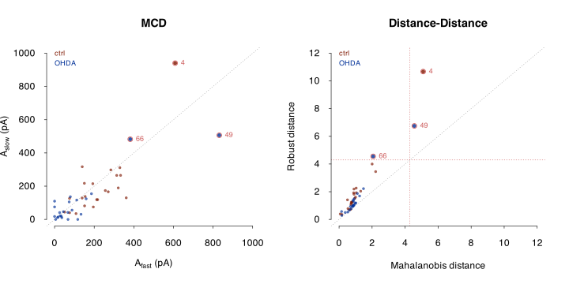


**Notes on multivariate outlier detection:**

- The classical Mahalanobis distance is **not** a reliable outlier detection statistic in the presence of multiple outliers because of masking. Use only as a comparison against the robust distance.

- The **MCD estimator** (`method='MCD'`) is computationally efficient (FAST-MCD algorithm; Rousseeuw & Van Driessen, 1999) and is the recommended default.

- The **MVE estimator** (`method='MVE'`) is the original high-breakdown estimator used in Rousseeuw & van Zomeren (1990).

- The `alpha` argument controls the subset size used by MCD/MVE. The default of $\alpha = 0.5$ gives maximum robustness (50% breakdown).

- The `quant` argument sets the chi-squared cutoff quantile. The default of $0.975$ follows Rousseeuw & van Zomeren (1990). For small samples, a more conservative value such as $0.9999$ may be appropriate to reduce false positives.

- The **distance-distance plot** is a powerful diagnostic: points lying above the horizontal cutoff but to the left of the vertical cutoff are *masked* outliers — those that classical Mahalanobis distance fails to detect.


# <center>Code guide</center>

If any bug fixes are necessary (most likely related to providing help on other operating systems), it will be provided as an update on the parent [`GitHub` page](https://github.com/vernonclarke/Rfits).

For queries related to this repository, please [open an issue](https://github.com/vernonclarke/Rfits/issues) or [email](mailto:WOPR2@proton.me) directly 

   **References:**

   - Akaike, H. (1974). A new look at the statistical model identification. *IEEE Transactions on Automatic Control*, 19(6), 716-723.

   - Schwarz, G. (1978). Estimating the dimension of a model. *The Annals of Statistics*, 6(2), 461-464.

   - Kass, R. E., & Raftery, A. E. (1995). Bayes factors. *Journal of the American Statistical Association*, 90(430), 773-795.

   - Rousseeuw, P. J., & van Zomeren, B. C. (1990). Unmasking multivariate outliers and leverage points. *Journal of the American Statistical Association*, 85(411), 633–639.

   - Rousseeuw, P. J., & Van Driessen, K. (1999). A fast algorithm for the minimum covariance determinant estimator. *Technometrics*, 41(3), 212–223.
   
